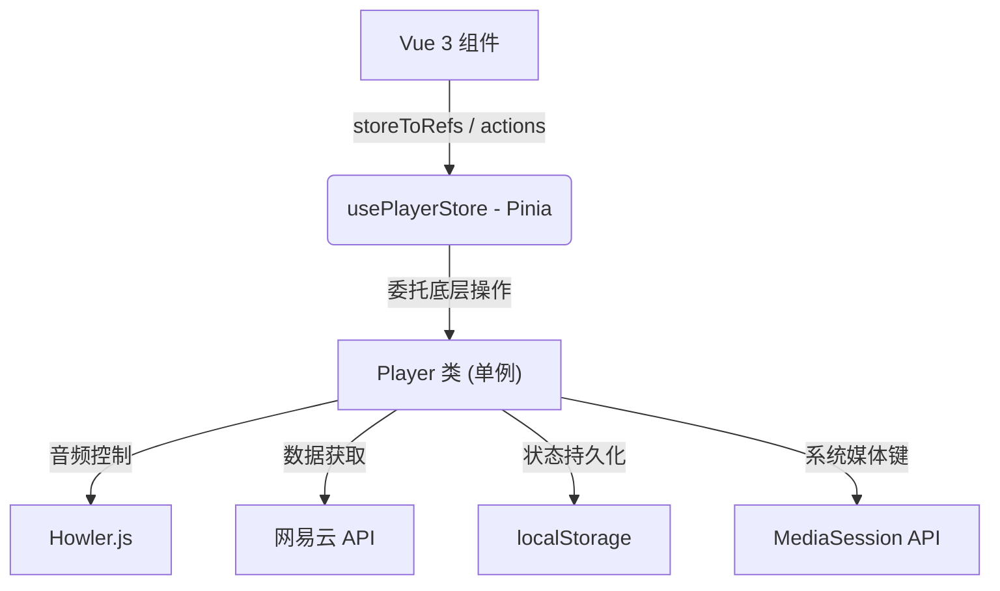

# Player.js 模块化分析与重构指南（Web 版）

> **原则**: 只做 Web 端，去掉所有 Electron / IPC / Tray / Mpris / Discord / UnblockNeteaseMusic 相关代码。

---

## 一、精简后的架构图



---

## 二、模块拆分（Web Only）

### 模块 1：状态定义 (State)

| 属性名 | 类型 | 说明 |
|---|---|---|
| `_playing` | `boolean` | 是否正在播放 |
| `_progress` | `number` | 当前进度（秒） |
| `_enabled` | `boolean` | 播放器是否已启用（决定是否显示底部栏） |
| `_volume` | `number` | 音量 (0~1) |
| `_volumeBeforeMuted` | `number` | 静音前备份音量 |
| `_repeatMode` | `'off'|'on'|'one'` | 循环模式 |
| `_shuffle` | `boolean` | 是否随机播放 |
| `_reversed` | `boolean` | 是否倒序播放 |
| `_list` | `number[]` | 播放列表（存 trackID） |
| `_current` | `number` | 当前播放在列表中的索引 |
| `_shuffledList` | `number[]` | 打乱后的列表（随机模式） |
| `_playlistSource` | `PlaylistSource` | 当前歌单来源 |
| `_currentTrack` | `Track` | 当前歌曲完整数据 |
| `_playNextList` | `number[]` | "下一首播放"队列 |
| `_isPersonalFM` | `boolean` | 是否处于私人 FM 模式 |
| `_personalFMTrack` | `Track` | 私人 FM 当前歌曲 |
| `_personalFMNextTrack` | `Track` | 私人 FM 预加载的下一首 |
| `_howler` | `Howl\|null` | Howler.js 实例（不序列化） |

---

### 模块 2：Getter / Setter

| 属性 | 说明 |
|---|---|
| `list` | 根据 `shuffle` 返回正序 / 打乱列表 |
| `current` | 根据 `shuffle` 返回正确的索引 |
| `playing` | 只读 |
| `enabled` | 只读 |
| `progress` (set) | 写入时调用 `howler.seek(value)` |
| `volume` (set) | 写入时直接驱动 Howler 音量 |
| `repeatMode` (set) | 验证合法值，FM 模式下忽略 |
| `shuffle` (set) | 切换后自动调用 `_shuffleTheList()` |

---

### 模块 3：内部辅助方法 (精简版)

> ❌ 已删除: `setTrayLikeState`, `_updateMprisState`, `_playDiscordPresence`, `_pauseDiscordPresence`, `_getAudioSourceFromUnblockMusic`, `sendSelfToIpcMain`

| 方法名 | 功能 |
|---|---|
| `_init()` | 从 localStorage 恢复状态，初始化 Howler，加载私人 FM |
| `_setIntervals()` | 每秒同步进度到 `_progress` 和 localStorage |
| `_getNextTrack()` | 根据循环/倒序模式计算下一首 |
| `_getPrevTrack()` | 根据循环/倒序模式计算上一首 |
| `_shuffleTheList()` | 打乱播放列表 |
| `_scrobble()` | 上报网易云播放记录 |
| `_playAudioSource()` | 创建 Howl 实例并播放 |
| `_getAudioSourceFromCache()` | 从 IndexedDB 本地缓存获取音频 |
| `_getAudioSourceFromNetease()` | 从网易云 API 获取音频链接 |
| `_getAudioSource()` | 分层获取：① 缓存 → ② 网易云 |
| `_replaceCurrentTrack()` | 切歌主流程（请求详情 → 替换音频源） |
| `_replaceCurrentTrackAudio()` | 获取音频 URL 后创建 Howler 实例 |
| `_cacheNextTrack()` | 提前缓存下一首到 IndexedDB |
| `_loadSelfFromLocalStorage()` | 恢复所有序列化状态 |
| `_initMediaSession()` | 注册系统媒体键（MediaSession API） |
| `_updateMediaSessionMetaData()` | 更新系统通知栏的歌曲信息 |
| `_nextTrackCallback()` | 歌曲播放结束时触发 |
| `_loadPersonalFMNextTrack()` | 预加载私人 FM 的下一首 |

---

### 模块 4：播放控制

| 方法 | 功能 |
|---|---|
| `play()` | 播放（淡入） |
| `pause()` | 暂停（淡出） |
| `playOrPause()` | 切换播放/暂停 |
| `seek(time)` | 跳转进度 |
| `mute()` | 静音切换 |

---

### 模块 5：列表管理

| 方法 | 功能 |
|---|---|
| `replacePlaylist()` | 替换整个播放列表 |
| `playAlbumByID()` | 播放专辑 |
| `playPlaylistByID()` | 播放歌单 |
| `playArtistByID()` | 播放艺人热歌 |
| `playTrackOnListByID()` | 在当前列表中播放指定歌曲 |
| `playIntelligenceListById()` | 心动模式 |
| `addTrackToPlayNext()` | 添加到"下一首播放"队列 |
| `playPersonalFM()` | 开启私人 FM |
| `moveToFMTrash()` | 将当前 FM 歌曲移至垃圾桶 |

---

### 模块 6：模式切换 & 持久化

| 方法 | 功能 |
|---|---|
| `switchRepeatMode()` | 切换循环模式 `off→on→one` |
| `switchShuffle()` | 切换随机播放 |
| `switchReversed()` | 切换倒序播放 |
| `clearPlayNextList()` | 清空队列 |
| `removeTrackFromQueue()` | 移除队列中的歌曲 |
| `saveSelfToLocalStorage()` | 持久化所有状态 |

---

## 三、TypeScript 类型定义

```typescript
// src/utils/Player.ts 文件顶部

export type RepeatMode = 'off' | 'on' | 'one';
export type PlaylistSourceType = 'album' | 'playlist' | 'artist' | 'url';

export interface PlaylistSource {
  type: PlaylistSourceType;
  id: number | string;
}

export interface Artist { id: number; name: string; }
export interface Album { id: number; name: string; picUrl: string; }

export interface Track {
  id: number;
  name: string;
  dt: number;      // 时长（毫秒）
  ar: Artist[];
  al: Album;
  artists?: Artist[];
  no?: number;
  mark?: number;
}
```

---

## 四、Pinia Store 模板

```typescript
// src/store/player.ts
import { defineStore } from 'pinia';
import { ref, computed } from 'vue';
import Player from '@/utils/Player';
import type { Track, RepeatMode, PlaylistSource, PlaylistSourceType } from '@/utils/Player';

export const usePlayerStore = defineStore('player', () => {
  const player = new Player();

  // 响应式状态（Player 内部更新后需同步这些值）
  const playing = ref(false);
  const enabled = ref(false);
  const progress = ref(0);
  const currentTrack = ref<Track>(player._currentTrack);
  const repeatMode = ref<RepeatMode>(player._repeatMode);
  const shuffle = ref(player._shuffle);
  const volume = ref(player._volume);
  const isPersonalFM = ref(player._isPersonalFM);
  const personalFMTrack = ref<Track>(player._personalFMTrack);
  const playlistSource = ref<PlaylistSource>(player._playlistSource);

  const currentTrackID = computed(() => currentTrack.value?.id ?? 0);

  // Actions 委托给 Player 实例
  const play = () => player.play();
  const pause = () => player.pause();
  const playOrPause = () => player.playOrPause();
  const seek = (time: number) => player.seek(time);
  const mute = () => player.mute();
  const playNextTrack = () => player.playNextTrack();
  const playPrevTrack = () => player.playPrevTrack();
  const switchRepeatMode = () => player.switchRepeatMode();
  const switchShuffle = () => player.switchShuffle();
  const replacePlaylist = (
    trackIDs: number[],
    sourceID: string | number,
    sourceType: PlaylistSourceType,
    autoPlayTrackID?: number | 'first'
  ) => player.replacePlaylist(trackIDs, sourceID, sourceType, autoPlayTrackID);
  const playAlbumByID = (id: number, trackID?: number | 'first') => player.playAlbumByID(id, trackID);
  const playPlaylistByID = (id: number, trackID?: number | 'first') => player.playPlaylistByID(id, trackID);
  const playArtistByID = (id: number) => player.playArtistByID(id);
  const playPersonalFM = () => player.playPersonalFM();
  const playNextFMTrack = () => player.playNextFMTrack();
  const moveToFMTrash = () => player.moveToFMTrash();

  return {
    playing, enabled, progress, currentTrack, currentTrackID,
    repeatMode, shuffle, volume, isPersonalFM, personalFMTrack, playlistSource,
    play, pause, playOrPause, seek, mute,
    playNextTrack, playPrevTrack, switchRepeatMode, switchShuffle,
    replacePlaylist, playAlbumByID, playPlaylistByID, playArtistByID,
    playPersonalFM, playNextFMTrack, moveToFMTrash,
  };
});
```

---

## 五、需要删除的代码清单

| 行号 | 需删除的内容 |
|---|---|
| `L28-L31` | `electron` 和 `ipcRenderer` 变量声明 |
| `L44-L51` | `setTitle` 中的 `ipcRenderer?.send(...)` 和 `setTrayLikeState` 整个函数 |
| `L207-L209` | `progress` setter 中的 `ipcRenderer?.send('seeked')` |
| `L243-L247` | `_setPlaying` 中的 Tray 更新调用 |
| `L416-L483` | `_getAudioSourceFromUnblockMusic()` 整个方法 |
| `L371` | `setTrayLikeState(...)` 调用 |
| `L629-L653` | `_updateMprisState()` 整个方法 |
| `L696-L715` | `_playDiscordPresence()` 和 `_pauseDiscordPresence()` |
| `L836-L844` | `play()` 中的 LastFM 上报（可选删除） |
| `L962-L970` | `sendSelfToIpcMain()` 整个方法 |
| `L980-L988` | `switchRepeatMode/switchShuffle` 中的 `ipcRenderer?.send(...)` |
