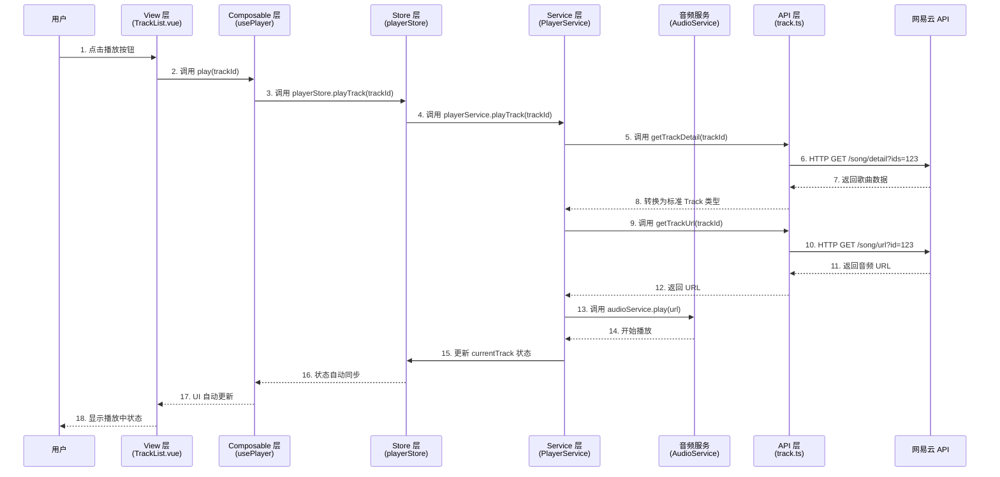

# YesPlayMusic 重构流程指南

> **从页面到 API 的完整数据流与重构步骤**

---

## 第一部分：数据流全景图

### 用户点击播放按钮的完整流程



---

## 第二部分：分层架构详解

### 架构层次（由外到内）

```
┌─────────────────────────────────────────┐
│  View 层（视图组件）                     │  ← 用户交互
│  - TrackList.vue, Player.vue           │
└─────────────────────────────────────────┘
              ↓ 调用
┌─────────────────────────────────────────┐
│  Composable 层（组合式函数）             │  ← 组件逻辑复用
│  - usePlayer, useLyrics                │
└─────────────────────────────────────────┘
              ↓ 读写
┌─────────────────────────────────────────┐
│  Store 层（全局状态管理）                │  ← 跨组件共享状态
│  - playerStore, userStore              │
└─────────────────────────────────────────┘
              ↓ 调用
┌─────────────────────────────────────────┐
│  Service 层（业务服务）                  │  ← 复杂业务逻辑
│  - PlayerService, AudioService         │
└─────────────────────────────────────────┘
              ↓ 调用
┌─────────────────────────────────────────┐
│  API 层（接口封装）                      │  ← HTTP 请求
│  - track.ts, playlist.ts               │
└─────────────────────────────────────────┘
              ↓ HTTP
┌─────────────────────────────────────────┐
│  Backend（网易云 API）                   │
└─────────────────────────────────────────┘
```

---

## 第三部分：重构步骤（推荐顺序）

### 阶段 0：准备工作（第 1 天）

#### Step 0.1: 创建新分支

```bash
git checkout -b refactor/vue3-migration
```

#### Step 0.2: 安装依赖

```bash
# 移除旧依赖
npm uninstall vue@2 vuex@3 vue-router@3 @vue/cli-service

# 安装新依赖
npm install vue@3 vue-router@4 pinia vite @vitejs/plugin-vue
npm install -D typescript @types/node vue-tsc
```

#### Step 0.3: 创建目录结构

```bash
mkdir -p src/{types,stores,composables,services}
mkdir -p src/types/{entities,enums,api}
mkdir -p src/stores/modules
mkdir -p src/api/modules
```

---

### 阶段 1：类型系统搭建（第 2-3 天）

#### Step 1.1: 定义核心实体类型

**文件**: `src/types/entities/track.ts`

```typescript
// 1. 先定义最核心的实体
export interface Track {
  id: number;
  name: string;
  artists: Artist[];
  album: Album;
  duration: number;
  // ... 其他字段
}

export interface Artist {
  id: number;
  name: string;
}

export interface Album {
  id: number;
  name: string;
  picUrl: string;
}
```

**检查点**：能否导入并使用这些类型？

```typescript
import type { Track } from "@/types/entities/track";
const track: Track = {
  /* ... */
};
```

#### Step 1.2: 定义枚举类型

**文件**: `src/types/enums/playMode.ts`

```typescript
export type RepeatMode = "off" | "on" | "one";
export type PlaybackQuality = "standard" | "high" | "lossless";
```

#### Step 1.3: 定义 API 响应类型

**文件**: `src/types/api/track.types.ts`

```typescript
// 网易云 API 返回的原始格式
export interface TrackDetailResponse {
  code: number;
  songs: RawTrack[];
}

export interface RawTrack {
  id: number;
  name: string;
  ar: { id: number; name: string }[]; // 艺术家
  al: { id: number; name: string; picUrl: string }; // 专辑
  dt: number; // duration
}
```

---

### 阶段 2：API 层重构（第 4-5 天）

#### Step 2.1: 配置 Axios 实例

**文件**: `src/api/request.ts`

```typescript
import axios from "axios";

const request = axios.create({
  baseURL: import.meta.env.VITE_API_BASE_URL,
  timeout: 15000,
  withCredentials: true,
});

// 请求拦截器
request.interceptors.request.use((config) => {
  const token = localStorage.getItem("MUSIC_U");
  if (token) {
    config.params = { ...config.params, cookie: `MUSIC_U=${token}` };
  }
  return config;
});

// 响应拦截器
request.interceptors.response.use(
  (response) => response.data,
  (error) => {
    // 统一错误处理
    return Promise.reject(error);
  },
);

export default request;
```

**测试**：

```typescript
import request from "@/api/request";
request.get("/test").then(console.log);
```

#### Step 2.2: 重构 API 模块

**文件**: `src/api/modules/track.ts`

```typescript
import request from "../request";
import type { TrackDetailResponse } from "@/types/api/track.types";
import type { Track } from "@/types/entities/track";

/**
 * 获取歌曲详情
 * @param ids - 歌曲 ID（可以是单个或多个，用逗号分隔）
 */
export async function getTrackDetail(ids: number | string): Promise<Track[]> {
  // 1. 调用 API
  const res = await request.get<TrackDetailResponse>("/song/detail", {
    params: { ids: String(ids) },
  });

  // 2. 转换为标准格式
  return res.songs.map(transformTrack);
}

/**
 * 获取歌曲播放 URL
 */
export async function getTrackUrl(id: number) {
  const res = await request.get("/song/url", {
    params: { id },
  });
  return res.data[0]?.url || null;
}

// 类型转换函数
function transformTrack(raw: RawTrack): Track {
  return {
    id: raw.id,
    name: raw.name,
    artists: raw.ar.map((a) => ({ id: a.id, name: a.name })),
    album: {
      id: raw.al.id,
      name: raw.al.name,
      picUrl: raw.al.picUrl,
    },
    duration: raw.dt,
  };
}
```

**测试**：

```typescript
import { getTrackDetail } from "@/api/modules/track";

getTrackDetail(123456).then((tracks) => {
  console.log(tracks[0].name); // ✅ 类型安全，有自动补全
});
```

#### Step 2.3: 逐个迁移其他 API 模块

- `src/api/modules/playlist.ts`
- `src/api/modules/album.ts`
- `src/api/modules/user.ts`
- `src/api/modules/auth.ts`

---

### 阶段 3：Service 层搭建（第 6-8 天）

#### Step 3.1: 创建 AudioService

**文件**: `src/services/AudioService.ts`

```typescript
import { Howl, Howler } from "howler";

export class AudioService {
  private howler: Howl | null = null;

  async play(url: string): Promise<void> {
    this.unload();

    this.howler = new Howl({
      src: [url],
      html5: true,
      format: ["mp3", "flac"],
    });

    this.howler.play();
  }

  pause(): void {
    this.howler?.pause();
  }

  resume(): void {
    this.howler?.play();
  }

  seek(time: number): void {
    this.howler?.seek(time);
  }

  getSeek(): number {
    return this.howler?.seek() ?? 0;
  }

  unload(): void {
    this.howler?.unload();
    this.howler = null;
  }
}

// 单例导出
export const audioService = new AudioService();
```

**测试**：

```typescript
import { audioService } from "@/services/AudioService";

audioService.play("https://example.com/audio.mp3");
audioService.pause();
```

#### Step 3.2: 创建 PlayerService

**文件**: `src/services/PlayerService.ts`

```typescript
import { audioService } from "./AudioService";
import { getTrackDetail, getTrackUrl } from "@/api/modules/track";
import type { Track } from "@/types/entities/track";

export class PlayerService {
  /**
   * 播放指定歌曲
   */
  async playTrack(trackId: number): Promise<Track> {
    // 1. 获取歌曲详情
    const [track] = await getTrackDetail(trackId);

    // 2. 获取播放 URL
    const url = await getTrackUrl(trackId);
    if (!url) {
      throw new Error("无法获取播放链接");
    }

    // 3. 播放音频
    await audioService.play(url);

    return track;
  }

  pause(): void {
    audioService.pause();
  }

  resume(): void {
    audioService.resume();
  }
}

export const playerService = new PlayerService();
```

---

### 阶段 4：Store 层重构（第 9-11 天）

#### Step 4.1: 创建 Pinia 实例

**文件**: `src/stores/index.ts`

```typescript
import { createPinia } from "pinia";

const pinia = createPinia();

export default pinia;
```

**文件**: `src/main.ts`

```typescript
import { createApp } from "vue";
import App from "./App.vue";
import pinia from "./stores";

createApp(App).use(pinia).mount("#app");
```

#### Step 4.2: 创建 PlayerStore

**文件**: `src/stores/modules/player.ts`

```typescript
import { defineStore } from "pinia";
import { ref } from "vue";
import { playerService } from "@/services/PlayerService";
import type { Track } from "@/types/entities/track";

export const usePlayerStore = defineStore("player", () => {
  // State
  const playing = ref(false);
  const currentTrack = ref<Track | null>(null);
  const progress = ref(0);

  // Actions
  async function playTrack(trackId: number) {
    try {
      const track = await playerService.playTrack(trackId);
      currentTrack.value = track;
      playing.value = true;
    } catch (error) {
      console.error("播放失败:", error);
      throw error;
    }
  }

  function pause() {
    playerService.pause();
    playing.value = false;
  }

  function resume() {
    playerService.resume();
    playing.value = true;
  }

  return {
    playing,
    currentTrack,
    progress,
    playTrack,
    pause,
    resume,
  };
});
```

**测试**：

```typescript
import { usePlayerStore } from "@/stores/modules/player";

const store = usePlayerStore();
store.playTrack(123456);
console.log(store.playing); // true
```

#### Step 4.3: 迁移其他 Store

- `src/stores/modules/user.ts` - 用户状态
- `src/stores/modules/settings.ts` - 设置
- `src/stores/modules/liked.ts` - 喜欢的内容

---

### 阶段 5：Composable 层搭建（第 12-13 天）

#### Step 5.1: 创建 usePlayer

**文件**: `src/composables/usePlayer.ts`

```typescript
import { storeToRefs } from "pinia";
import { usePlayerStore } from "@/stores/modules/player";

/**
 * 播放器 Composable
 * 为组件提供简洁的播放器 API
 */
export function usePlayer() {
  const playerStore = usePlayerStore();

  // 解构状态（保持响应性）
  const { playing, currentTrack, progress } = storeToRefs(playerStore);

  // 方法（直接引用，不需要 storeToRefs）
  const { playTrack, pause, resume } = playerStore;

  return {
    // State
    playing,
    currentTrack,
    progress,

    // Actions
    play: playTrack,
    pause,
    resume,
  };
}
```

#### Step 5.2: 创建其他 Composables

- `src/composables/useLyrics.ts` - 歌词逻辑
- `src/composables/usePlaylist.ts` - 播放列表逻辑
- `src/composables/useAuth.ts` - 登录逻辑

---

### 阶段 6：View 层重构（第 14-20 天）

#### Step 6.1: 重构单个组件示例

**原 Vue 2 组件**: `src/components/TrackListItem.vue`

```vue
<!-- Vue 2 Options API -->
<template>
  <div class="track-item" @click="handlePlay">
    <span>{{ track.name }}</span>
  </div>
</template>

<script>
export default {
  props: {
    track: Object,
  },
  methods: {
    handlePlay() {
      this.$store.dispatch("playTrack", this.track.id);
    },
  },
};
</script>
```

**重构后 Vue 3 组件**:

```vue
<!-- Vue 3 Composition API + TypeScript -->
<template>
  <div class="track-item" @click="handlePlay">
    <span>{{ track.name }}</span>
  </div>
</template>

<script setup lang="ts">
import { usePlayer } from "@/composables/usePlayer";
import type { Track } from "@/types/entities/track";

// Props（使用 TypeScript 类型）
const props = defineProps<{
  track: Track;
}>();

// 使用 Composable
const { play } = usePlayer();

// 方法
function handlePlay() {
  play(props.track.id);
}
</script>
```

**重构检查清单**：

- [ ] 移除 `export default`，改用 `<script setup>`
- [ ] 添加 `lang="ts"`
- [ ] Props 使用 TypeScript 类型定义
- [ ] 用 Composable 替代 `this.$store`
- [ ] 移除 `methods`，改用普通函数

#### Step 6.2: 重构播放器组件

**文件**: `src/components/Player.vue`

```vue
<template>
  <div class="player">
    <!-- 歌曲信息 -->
    <div v-if="currentTrack" class="track-info">
      
      <div>
        <h3>{{ currentTrack.name }}</h3>
        <p>{{ currentTrack.artists.map((a) => a.name).join(", ") }}</p>
      </div>
    </div>

    <!-- 控制按钮 -->
    <div class="controls">
      <button @click="prev">⏮️</button>
      <button @click="togglePlay">{{ playing ? "⏸️" : "▶️" }}</button>
      <button @click="next">⏭️</button>
    </div>

    <!-- 进度条 -->
    <div class="progress-bar">
      <span>{{ formatTime(progress) }}</span>
      <input
        type="range"
        :value="progress"
        :max="currentTrack?.duration / 1000 || 0"
        @input="handleSeek"
      />
      <span>{{ formatTime(currentTrack?.duration / 1000 || 0) }}</span>
    </div>
  </div>
</template>

<script setup lang="ts">
import { usePlayer } from "@/composables/usePlayer";

const { playing, currentTrack, progress, pause, resume } = usePlayer();

function togglePlay() {
  playing.value ? pause() : resume();
}

function next() {
  // TODO: 实现下一首
}

function prev() {
  // TODO: 实现上一首
}

function handleSeek(e: Event) {
  const value = (e.target as HTMLInputElement).value;
  // TODO: 实现进度跳转
}

function formatTime(seconds: number): string {
  const m = Math.floor(seconds / 60);
  const s = Math.floor(seconds % 60);
  return `${m}:${s.toString().padStart(2, "0")}`;
}
</script>
```

#### Step 6.3: 逐个重构其他组件

**优先级排序**：

1. **核心组件**（第一批，3 天）
   - Player.vue
   - TrackList.vue
   - TrackListItem.vue
2. **页面组件**（第二批，4 天）
   - Home.vue
   - Playlist.vue
   - Album.vue
   - Search.vue
3. **通用组件**（第三批，2 天）
   - Modal.vue
   - Toast.vue
   - ContextMenu.vue

---

## 第四部分：完整示例 - 播放列表功能

### 场景：用户点击歌单，播放第一首歌

#### 1. View 层（用户点击）

**文件**: `src/views/Playlist/index.vue`

```vue
<template>
  <div class="playlist-page">
    <h1>{{ playlist?.name }}</h1>
    <button @click="playAll">播放全部</button>

    <TrackList :tracks="tracks" @play="handlePlayTrack" />
  </div>
</template>

<script setup lang="ts">
import { ref, onMounted } from "vue";
import { useRoute } from "vue-router";
import { usePlayer } from "@/composables/usePlayer";
import { getPlaylistDetail } from "@/api/modules/playlist";
import TrackList from "@/components/TrackList.vue";
import type { Playlist, Track } from "@/types/entities";

const route = useRoute();
const { play } = usePlayer();

const playlist = ref<Playlist | null>(null);
const tracks = ref<Track[]>([]);

onMounted(async () => {
  const id = Number(route.params.id);
  const data = await getPlaylistDetail(id);

  playlist.value = data.playlist;
  tracks.value = data.tracks;
});

function playAll() {
  if (tracks.value.length > 0) {
    play(tracks.value[0].id);
  }
}

function handlePlayTrack(track: Track) {
  play(track.id);
}
</script>
```

#### 2. Composable 层

**文件**: `src/composables/usePlayer.ts`

```typescript
export function usePlayer() {
  const playerStore = usePlayerStore();

  async function play(trackId: number) {
    await playerStore.playTrack(trackId);
  }

  return { play };
}
```

#### 3. Store 层

**文件**: `src/stores/modules/player.ts`

```typescript
export const usePlayerStore = defineStore("player", () => {
  const currentTrack = ref<Track | null>(null);
  const playing = ref(false);

  async function playTrack(trackId: number) {
    const track = await playerService.playTrack(trackId);
    currentTrack.value = track;
    playing.value = true;
  }

  return { currentTrack, playing, playTrack };
});
```

#### 4. Service 层

**文件**: `src/services/PlayerService.ts`

```typescript
export class PlayerService {
  async playTrack(trackId: number): Promise<Track> {
    // 调用 API 层
    const [track] = await getTrackDetail(trackId);
    const url = await getTrackUrl(trackId);

    // 调用音频服务
    await audioService.play(url);

    return track;
  }
}
```

#### 5. API 层

**文件**: `src/api/modules/track.ts`

```typescript
export async function getTrackDetail(id: number): Promise<Track[]> {
  const res = await request.get<TrackDetailResponse>("/song/detail", {
    params: { ids: id },
  });

  return res.songs.map(transformTrack);
}

export async function getTrackUrl(id: number): Promise<string | null> {
  const res = await request.get("/song/url", {
    params: { id },
  });

  return res.data[0]?.url || null;
}
```

#### 6. 网易云 API

```
GET https://music.163.com/api/song/detail?ids=123456
GET https://music.163.com/api/song/url?id=123456
```

---

## 第五部分：测试与验证

### 测试清单

#### 单元测试

```typescript
// tests/services/PlayerService.spec.ts
import { describe, it, expect, vi } from "vitest";
import { PlayerService } from "@/services/PlayerService";

describe("PlayerService", () => {
  it("should play track successfully", async () => {
    const service = new PlayerService();
    const track = await service.playTrack(123456);

    expect(track.id).toBe(123456);
    expect(track.name).toBeTruthy();
  });
});
```

#### 集成测试

```typescript
// tests/integration/playTrack.spec.ts
import { mount } from "@vue/test-utils";
import Player from "@/components/Player.vue";

it("should play track when button clicked", async () => {
  const wrapper = mount(Player);
  await wrapper.find(".play-button").trigger("click");

  expect(wrapper.vm.playing).toBe(true);
});
```

---

## 第六部分：常见问题与解决方案

### Q1: 如何处理循环依赖？

**问题**: Store 调用 Service，Service 又需要更新 Store

**解决**:

```typescript
// ❌ 错误：在 Service 中导入 Store
import { usePlayerStore } from "@/stores/modules/player";

export class PlayerService {
  async playTrack(id: number) {
    const store = usePlayerStore();
    store.setTrack(track); // 循环依赖！
  }
}

// ✅ 正确：Service 只返回数据，由 Store 更新状态
export class PlayerService {
  async playTrack(id: number): Promise<Track> {
    // 只负责获取数据
    return track;
  }
}

// Store 中
async function playTrack(id: number) {
  const track = await playerService.playTrack(id);
  currentTrack.value = track; // Store 负责更新状态
}
```

### Q2: 何时使用 Composable，何时使用 Store？

**判断标准**:

- **Store**: 需要跨多个页面/组件共享、需要持久化、需要 DevTools 追踪
- **Composable**: 仅在少数组件间复用、临时性状态、纯逻辑封装

### Q3: 如何逐步迁移，不影响现有功能？

**策略**: 使用适配器模式

```typescript
// 创建兼容层
export function useLegacyPlayer() {
  const playerStore = usePlayerStore();

  // 模拟 Vuex 的 API
  return {
    state: {
      playing: playerStore.playing,
      currentTrack: playerStore.currentTrack,
    },
    dispatch(action: string, payload: any) {
      if (action === "playTrack") {
        playerStore.playTrack(payload);
      }
    },
  };
}
```

---

## 第七部分：重构完成度检查

### 里程碑检查清单

- [ ] **阶段 1 完成** - 类型系统搭建
  - [ ] 所有核心实体都有 TypeScript 类型
  - [ ] API 响应类型定义完整
- [ ] **阶段 2 完成** - API 层重构
  - [ ] Axios 拦截器配置完成
  - [ ] 所有 API 模块都有类型定义
  - [ ] API 响应自动转换为标准格式
- [ ] **阶段 3 完成** - Service 层搭建
  - [ ] AudioService 正常工作
  - [ ] PlayerService 能播放歌曲
- [ ] **阶段 4 完成** - Store 层重构
  - [ ] Pinia 替代 Vuex
  - [ ] 核心 Store（player、user）完成
- [ ] **阶段 5 完成** - Composable 层
  - [ ] usePlayer 等核心 Composable 完成
- [ ] **阶段 6 完成** - View 层重构
  - [ ] 所有组件迁移到 Composition API
  - [ ] 所有组件使用 TypeScript

### 性能指标

- [ ] 首屏加载时间 < 1.5s
- [ ] 构建体积减少 > 20%
- [ ] 滚动性能稳定 60fps
- [ ] TypeScript 覆盖率 > 90%

---

**完成！这份重构流程指南涵盖了从准备工作到最终验证的完整步骤。建议按照阶段顺序执行，每完成一个阶段都进行测试验证！🎉**
