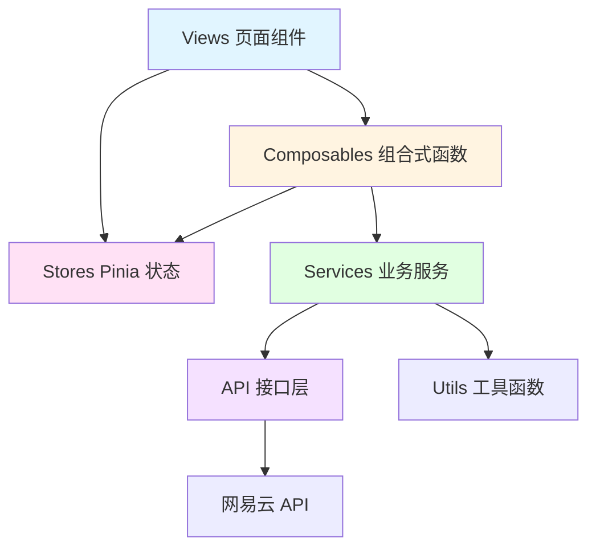
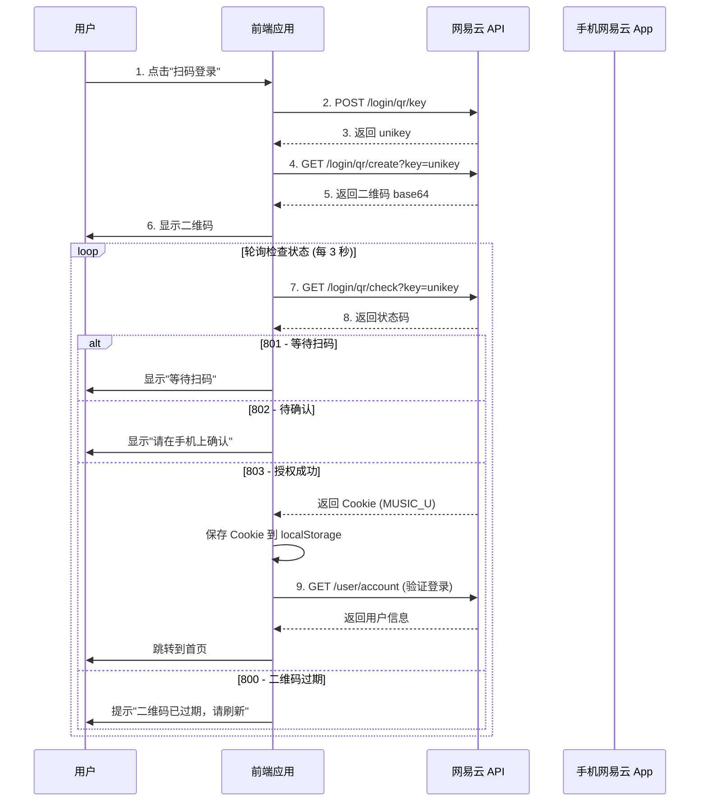

# YesPlayMusic Vue 3 重构学习与开发手册

> **目标读者**: 希望通过真实项目学习 Vue 3 企业级开发的前端初学者  
> **项目背景**: 将 YesPlayMusic 从 Vue 2 + Webpack + Vuex 重构为 Vue 3 + Vite + Pinia + TypeScript

---

## 第一章：架构设计与目录工程化

### 1.1 原项目架构分析

YesPlayMusic 是一个功能完整的网易云音乐第三方客户端，原项目采用 Vue 2 技术栈：

**技术栈概览**：

- **框架**: Vue 2.6.11 + Vue Router 3.4.3
- **状态管理**: Vuex 3.4.0
- **构建工具**: Vue CLI 4.5.0 + Webpack
- **音频库**: Howler.js 2.2.3
- **HTTP 客户端**: Axios 0.26.1
- **样式**: Sass/SCSS

**目录结构**：

```
src/
├── api/              # API 接口模块（按业务域划分）
│   ├── album.js      # 专辑相关接口
│   ├── artist.js     # 艺术家相关接口
│   ├── auth.js       # 认证登录接口
│   ├── playlist.js   # 歌单相关接口
│   ├── track.js      # 歌曲相关接口
│   └── user.js       # 用户相关接口
├── assets/           # 静态资源（图片、字体等）
├── components/       # 全局组件
├── store/            # Vuex 状态管理
│   ├── state.js      # 全局状态
│   ├── mutations.js  # 同步修改状态
│   ├── actions.js    # 异步操作
│   └── plugins/      # Vuex 插件
├── utils/            # 工具函数
│   ├── Player.js     # 核心播放器类（29KB，1001行）
│   ├── request.js    # Axios 封装与拦截器
│   ├── auth.js       # 认证工具
│   └── db.js         # IndexedDB 缓存
├── views/            # 页面组件
└── router/           # 路由配置
```

**架构特点与问题**：

✅ **优点**:

- API 层按业务域清晰划分
- Player 类封装了完整的播放逻辑
- 使用 IndexedDB 进行音频缓存优化

⚠️ **待改进**:

- **Vuex 状态管理复杂**: state/mutations/actions 分散在多个文件，维护困难
- **缺乏类型安全**: 纯 JavaScript 项目，编译时无法发现类型错误
- **Player.js 过于庞大**: 单文件 1001 行，职责耦合严重
- **缺少 Composables**: 逻辑复用主要通过 Mixins，容易造成命名冲突
- **构建速度慢**: Webpack 开发服务器启动较慢

---

### 1.2 Vue 3 企业级目录结构设计

基于现代前端工程化最佳实践，我们重新设计目录结构：

```
src/
├── api/                    # API 接口层
│   ├── modules/            # 按业务模块划分
│   │   ├── album.ts
│   │   ├── artist.ts
│   │   ├── auth.ts
│   │   ├── playlist.ts
│   │   ├── track.ts
│   │   └── user.ts
│   ├── types/              # API 请求/响应类型定义
│   │   ├── album.types.ts
│   │   ├── artist.types.ts
│   │   └── track.types.ts
│   └── request.ts          # Axios 实例与拦截器配置
│
├── assets/                 # 静态资源
│   ├── images/
│   ├── fonts/
│   └── styles/             # 全局样式
│       ├── variables.scss  # SCSS 变量
│       ├── mixins.scss     # SCSS 混合
│       └── global.scss     # 全局样式
│
├── components/             # 全局组件
│   ├── common/             # 通用组件
│   │   ├── Button/
│   │   ├── Modal/
│   │   └── Toast/
│   └── music/              # 音乐业务组件
│       ├── TrackList/
│       ├── Cover/
│       └── Player/
│
├── composables/            # 组合式函数（Hooks）
│   ├── usePlayer.ts        # 播放器逻辑
│   ├── useAuth.ts          # 认证逻辑
│   ├── useLyrics.ts        # 歌词逻辑
│   ├── usePlaylist.ts      # 播放列表逻辑
│   └── useInfiniteScroll.ts # 无限滚动
│
├── stores/                 # Pinia 状态管理
│   ├── modules/            # 按功能模块划分
│   │   ├── player.ts       # 播放器状态
│   │   ├── user.ts         # 用户状态
│   │   ├── settings.ts     # 设置状态
│   │   └── liked.ts        # 喜欢的内容状态
│   ├── types/              # Store 类型定义
│   │   └── player.types.ts
│   └── index.ts            # Pinia 实例导出
│
├── types/                  # 全局类型定义
│   ├── entities/           # 核心实体类型
│   │   ├── track.ts        # 歌曲实体
│   │   ├── album.ts        # 专辑实体
│   │   ├── artist.ts       # 艺术家实体
│   │   └── playlist.ts     # 歌单实体
│   ├── enums/              # 枚举类型
│   │   ├── playMode.ts     # 播放模式枚举
│   │   └── quality.ts      # 音质枚举
│   └── global.d.ts         # 全局类型声明
│
├── services/               # 业务服务层
│   ├── PlayerService.ts    # 播放器服务（拆分后的 Player.js）
│   ├── AudioService.ts     # 音频播放服务
│   ├── LyricService.ts     # 歌词服务
│   └── CacheService.ts     # 缓存服务
│
├── utils/                  # 工具函数
│   ├── format.ts           # 格式化工具
│   ├── storage.ts          # 本地存储工具
│   ├── crypto.ts           # 加密工具
│   └── validators.ts       # 验证工具
│
├── router/                 # 路由配置
│   ├── index.ts            # 路由实例
│   ├── routes.ts           # 路由定义
│   └── guards.ts           # 路由守卫
│
├── views/                  # 页面组件
│   ├── Home/
│   ├── Playlist/
│   ├── Album/
│   └── Login/
│
├── App.vue                 # 根组件
└── main.ts                 # 应用入口
```

---

### 1.3 目录划分原则与解耦策略

#### **为什么要这样划分？**

##### **1. `composables/` - 组合式函数（逻辑复用层）**

**设计目的**: 将可复用的业务逻辑从组件中提取出来，实现逻辑与视图的分离。

**与 Vue 2 Mixins 的区别**:

```javascript
// ❌ Vue 2 Mixins - 存在命名冲突风险
export default {
  mixins: [playerMixin, authMixin], // 如果两个 mixin 都有 data() 中的 loading 变量，会冲突
};

// ✅ Vue 3 Composables - 明确的命名空间
import { usePlayer } from "@/composables/usePlayer";
import { useAuth } from "@/composables/useAuth";

const { loading: playerLoading } = usePlayer();
const { loading: authLoading } = useAuth(); // 可以轻松重命名避免冲突
```

**典型场景**:

- `usePlayer.ts`: 封装播放、暂停、进度控制等逻辑
- `useAuth.ts`: 封装登录状态检查、Token 刷新逻辑
- `useLyrics.ts`: 封装歌词解析、时间轴同步逻辑

##### **2. `stores/` - Pinia 状态管理（全局状态层）**

**设计目的**: 管理跨组件共享的状态，如播放器状态、用户信息、应用设置。

**与 Vuex 的区别**:

```typescript
// ❌ Vuex - 需要通过 mutations 同步修改状态
store.commit("setPlaying", true);

// ✅ Pinia - 直接修改状态，代码更简洁
playerStore.playing = true;
// 或使用 action
playerStore.setPlaying(true);
```

**何时使用 Store vs Composable?**

- **Store**: 需要持久化、需要 DevTools 追踪、跨多个页面共享
- **Composable**: 仅在单个组件或少数组件间复用、临时性状态

##### **3. `services/` - 业务服务层（复杂业务逻辑封装）**

**设计目的**: 封装复杂的业务逻辑，使其与 UI 层完全解耦。

**为什么需要 Services 层？**

原项目的 `Player.js` 包含了：

- 音频播放控制（Howler.js 操作）
- 播放列表管理
- 网络请求（获取音频 URL）
- 缓存逻辑（IndexedDB）
- 歌词同步、Last.fm 上报等

这些职责混在一起，违反了**单一职责原则**。重构后：

```typescript
// PlayerService.ts - 协调各个子服务
class PlayerService {
  constructor(
    private audioService: AudioService,
    private lyricService: LyricService,
    private cacheService: CacheService,
  ) {}
}

// AudioService.ts - 专注于音频播放
class AudioService {
  private howler: Howl | null = null;
  play() {
    /* ... */
  }
  pause() {
    /* ... */
  }
}

// LyricService.ts - 专注于歌词处理
class LyricService {
  parseLyric(rawLyric: string) {
    /* ... */
  }
  getCurrentLine(time: number) {
    /* ... */
  }
}
```

##### **4. `api/` 与 `types/` - 接口层与类型层分离**

**类型定义的位置**:

- `api/types/`: API 相关的请求/响应类型
- `types/entities/`: 核心业务实体类型
- `stores/types/`: Store 状态类型

**为什么要分离？**

```typescript
// types/entities/track.ts - 标准化的业务实体（可在整个应用中复用）
export interface Track {
  id: number;
  name: string;
  artists: Artist[];
  album: Album;
  duration: number;
}

// api/types/track.types.ts - API 响应类型（与后端字段对应）
export interface TrackDetailResponse {
  songs: {
    id: number;
    name: string;
    ar: { id: number; name: string }[]; // 后端字段名
    al: { id: number; name: string; picUrl: string };
    dt: number; // duration 的缩写
  }[];
}

// 在 API 层进行转换
export async function getTrackDetail(id: number): Promise<Track> {
  const res = await request.get<TrackDetailResponse>(`/song/detail?ids=${id}`);
  return transformToTrack(res.songs[0]); // 转换为标准实体
}
```

---

### 1.4 依赖关系与数据流



**数据流向示例**:

1. **用户点击播放按钮** → `Player.vue` 组件
2. 组件调用 → `usePlayer()` Composable
3. Composable 调用 → `playerStore.play(trackId)`
4. Store 调用 → `PlayerService.playTrack(trackId)`
5. Service 调用 → `audioService.play()` + `apiModule.getTrackUrl()`
6. API 层 → 发起 HTTP 请求到网易云 API
7. 响应回流 → Service → Store → Composable → 组件自动响应式更新

---

## 第二章：核心业务流拆解

### 2.1 音乐播放器核心逻辑深度解析

#### **2.1.1 原 Player.js 职责分析**

原项目的 `Player.js` 是一个包含 1001 行代码的超大类，主要职责包括：

1. **音频播放控制** (Howler.js 封装)
2. **播放模式管理** (顺序/随机/单曲循环)
3. **播放列表管理** (当前播放列表、下一首播放队列)
4. **音频源获取** (缓存优先 → 网易云 API → UnblockMusic)
5. **歌词同步**
6. **播放进度追踪与上报** (Last.fm Scrobble)
7. **私人 FM 模式**
8. **MediaSession API 集成** (系统媒体控制)

让我们逐一拆解这些核心功能：

---

#### **2.1.2 Web Audio API 封装 - AudioService**

**原代码片段** (`Player.js:332-374`):

```javascript
_playAudioSource(source, autoplay = true) {
  Howler.unload()
  this._howler = new Howl({
    src: [source],
    html5: true,
    preload: true,
    format: ['mp3', 'flac'],
    onend: () => {
      this._nextTrackCallback()
    },
  })

  this._howler.on('loaderror', (_, errCode) => {
    // 错误处理逻辑...
  })

  if (autoplay) {
    this.play()
  }
}
```

**为什么要重构？**

- 播放逻辑与其他业务逻辑耦合（如 `_nextTrackCallback`）
- 错误处理逻辑复杂，应该抽离
- 缺少类型安全

**重构后的 AudioService.ts**:

```typescript
import { Howl, Howler } from "howler";
import type { AudioConfig, AudioEventHandlers } from "@/types/audio";

/**
 * 音频播放服务
 *
 * 职责：
 * 1. 封装 Howler.js 的底层 API
 * 2. 提供统一的音频播放接口
 * 3. 处理音频加载错误与重试逻辑
 *
 * 为什么使用类而不是 Composable？
 * - AudioService 需要维护单一的 Howl 实例（单例模式）
 * - 需要在多个 Composable 中共享（通过依赖注入）
 * - 类更适合封装有状态的底层服务
 */
export class AudioService {
  private howler: Howl | null = null;
  private currentSource: string = "";

  /**
   * 播放音频
   * @param source - 音频源 URL 或 Blob URL
   * @param config - 播放配置
   * @param handlers - 事件回调函数
   */
  async play(
    source: string,
    config: AudioConfig = {},
    handlers: AudioEventHandlers = {},
  ): Promise<void> {
    // 1. 卸载之前的音频实例（释放内存）
    //    ⚠️ 重要：Howler 不会自动销毁，必须手动 unload
    this.unload();

    // 2. 创建新的 Howl 实例
    this.currentSource = source;
    this.howler = new Howl({
      src: [source],
      html5: true, // 使用 HTML5 Audio（而非 Web Audio API）
      // 原因：HTML5 Audio 对流媒体支持更好，内存占用更低
      preload: true, // 预加载音频数据
      format: config.format || ["mp3", "flac"],
      volume: config.volume ?? 1,

      // 3. 注册事件监听器
      onend: () => handlers.onEnd?.(),
      onloaderror: (_, errCode) =>
        this.handleLoadError(errCode, handlers.onError),
      onplayerror: (_, errCode) =>
        this.handlePlayError(errCode, handlers.onError),
    });

    // 4. 开始播放
    this.howler.play();
  }

  /**
   * 暂停播放
   */
  pause(): void {
    this.howler?.pause();
  }

  /**
   * 恢复播放
   */
  resume(): void {
    this.howler?.play();
  }

  /**
   * 跳转到指定时间
   * @param time - 时间（秒）
   */
  seek(time: number): void {
    this.howler?.seek(time);
  }

  /**
   * 获取当前播放进度
   * @returns 当前时间（秒）
   */
  getSeek(): number {
    return this.howler?.seek() ?? 0;
  }

  /**
   * 设置音量
   * @param volume - 音量值（0-1）
   */
  setVolume(volume: number): void {
    const clampedVolume = Math.max(0, Math.min(1, volume));
    this.howler?.volume(clampedVolume);
  }

  /**
   * 获取当前音量
   */
  getVolume(): number {
    return this.howler?.volume() ?? 1;
  }

  /**
   * 获取播放状态
   */
  isPlaying(): boolean {
    return this.howler?.playing() ?? false;
  }

  /**
   * 卸载当前音频实例
   *
   * 为什么需要手动卸载？
   * - Howler 创建的音频实例会持续占用内存
   * - 不卸载的话，切歌多次后会导致内存泄漏
   * - unload() 会释放音频数据、事件监听器等资源
   */
  unload(): void {
    this.howler?.unload();
    this.howler = null;
  }

  /**
   * 处理音频加载错误
   *
   * 错误码说明（MediaError）：
   * 1: MEDIA_ERR_ABORTED - 用户中止
   * 2: MEDIA_ERR_NETWORK - 网络错误
   * 3: MEDIA_ERR_DECODE - 解码错误（文件损坏或格式不支持）
   * 4: MEDIA_ERR_SRC_NOT_SUPPORTED - 不支持的音频格式
   */
  private handleLoadError(
    errCode: number,
    onError?: (error: AudioError) => void,
  ): void {
    const error: AudioError = {
      code: errCode,
      source: this.currentSource,
      message: this.getErrorMessage(errCode),
      recoverable: errCode !== 3 && errCode !== 4, // 解码错误和格式不支持无法恢复
    };

    onError?.(error);
  }

  private handlePlayError(
    errCode: number,
    onError?: (error: AudioError) => void,
  ): void {
    // 处理播放错误（如自动播放被浏览器阻止）
    const error: AudioError = {
      code: errCode,
      source: this.currentSource,
      message: "播放失败，可能是浏览器阻止了自动播放",
      recoverable: true,
    };

    onError?.(error);
  }

  private getErrorMessage(errCode: number): string {
    const messages: Record<number, string> = {
      1: "音频加载被中止",
      2: "网络错误导致音频加载失败",
      3: "音频解码失败（文件可能已损坏）",
      4: "不支持的音频格式",
    };
    return messages[errCode] || "未知错误";
  }
}

// 类型定义
export interface AudioConfig {
  format?: string[];
  volume?: number;
}

export interface AudioEventHandlers {
  onEnd?: () => void;
  onError?: (error: AudioError) => void;
}

export interface AudioError {
  code: number;
  source: string;
  message: string;
  recoverable: boolean;
}
```

**关键设计决策解释**:

1. **为什么使用 `html5: true`？**
   - HTML5 Audio 更适合流媒体播放，支持边下载边播放
   - Web Audio API 需要完整下载后才能播放，不适合大文件

2. **为什么需要 `unload()`？**
   - Howler.js 不会自动销毁实例
   - 每次切歌如果不 unload，内存会持续增长
   - 在 Chrome DevTools Memory 面板可以看到 AudioBuffer 占用

3. **为什么错误处理要区分 `recoverable`？**
   - 网络错误（code 2）可以重试或切换音源
   - 解码错误（code 3）说明文件本身有问题，重试无意义

---

#### **2.1.3 播放列表调度 - PlaylistService**

**原代码逻辑** (`Player.js:261-299`):

```javascript
_getNextTrack() {
  const next = this._reversed ? this.current - 1 : this.current + 1

  // 1. 优先播放"下一首播放"队列
  if (this._playNextList.length > 0) {
    let trackID = this._playNextList[0]
    return [trackID, INDEX_IN_PLAY_NEXT]
  }

  // 2. 循环模式处理
  if (this.repeatMode === 'on') {
    if (this._reversed && this.current === 0) {
      return [this.list[this.list.length - 1], this.list.length - 1]
    } else if (this.list.length === this.current + 1) {
      return [this.list[0], 0]
    }
  }

  // 3. 返回下一首
  return [this.list[next], next]
}
```

**播放模式的复杂性**:

- 顺序播放 / 倒序播放
- 列表循环 / 单曲循环
- 随机播放（需要维护 `_shuffledList`）
- "下一首播放"队列（优先级最高）

**重构后的 PlaylistService.ts**:

```typescript
import { shuffle as _shuffle } from "lodash-es";
import type { PlayMode, RepeatMode } from "@/types/enums";

/**
 * 播放列表管理服务
 *
 * 职责：
 * 1. 管理播放列表（原始列表 + 随机列表）
 * 2. 计算下一首/上一首歌曲
 * 3. 处理"下一首播放"队列
 * 4. 处理各种播放模式的逻辑
 *
 * 为什么需要单独的 Service？
 * - 播放列表逻辑复杂，需要独立测试
 * - 与音频播放逻辑解耦，方便单元测试
 * - 可以在不实际播放音频的情况下预览下一首歌曲
 */
export class PlaylistService {
  private originalList: number[] = []; // 原始播放列表
  private shuffledList: number[] = []; // 随机打乱的列表
  private playNextQueue: number[] = []; // "下一首播放"队列

  private currentIndex: number = 0; // 当前歌曲在列表中的索引
  private shuffledIndex: number = 0; // 当前歌曲在随机列表中的索引

  private repeatMode: RepeatMode = "off"; // off / on / one
  private isShuffleMode: boolean = false; // 是否随机播放
  private isReversedMode: boolean = false; // 是否倒序播放

  /**
   * 设置播放列表
   * @param trackIds - 歌曲 ID 列表
   * @param startIndex - 从第几首开始播放
   */
  setPlaylist(trackIds: number[], startIndex: number = 0): void {
    this.originalList = trackIds;
    this.currentIndex = startIndex;

    // 如果当前是随机模式，需要重新打乱列表
    if (this.isShuffleMode) {
      this.shufflePlaylist(trackIds[startIndex]);
    }
  }

  /**
   * 打乱播放列表
   * @param firstTrackId - 第一首歌曲 ID（保持在列表开头）
   *
   * 为什么要保持第一首歌曲？
   * - 用户点击某首歌播放后开启随机模式
   * - 期望当前歌曲继续播放，后续歌曲才随机
   */
  shufflePlaylist(firstTrackId?: number): void {
    if (firstTrackId) {
      // 将第一首歌排除后打乱，再把第一首歌放回开头
      const otherTracks = this.originalList.filter((id) => id !== firstTrackId);
      this.shuffledList = [firstTrackId, ..._shuffle(otherTracks)];
      this.shuffledIndex = 0;
    } else {
      this.shuffledList = _shuffle([...this.originalList]);
    }
  }

  /**
   * 获取下一首歌曲
   * @returns { trackId, index } 或 null（无下一首）
   *
   * 优先级：
   * 1. "下一首播放"队列
   * 2. 单曲循环 → 返回当前歌曲
   * 3. 列表循环 → 到达列表末尾时回到开头
   * 4. 普通模式 → 播放完最后一首后停止
   */
  getNextTrack(): { trackId: number; index: number } | null {
    // 1. 优先播放"下一首播放"队列
    if (this.playNextQueue.length > 0) {
      const trackId = this.playNextQueue.shift()!; // 取出队列第一首
      return {
        trackId,
        index: -1, // -1 表示来自队列，不更新当前索引
      };
    }

    // 2. 获取当前使用的列表和索引
    const currentList = this.isShuffleMode
      ? this.shuffledList
      : this.originalList;
    const currentIdx = this.isShuffleMode
      ? this.shuffledIndex
      : this.currentIndex;

    // 3. 计算下一首的索引
    const nextIdx = this.isReversedMode ? currentIdx - 1 : currentIdx + 1;

    // 4. 边界处理
    if (nextIdx < 0) {
      // 到达列表开头
      if (this.repeatMode === "on") {
        // 列表循环：跳到最后一首
        return {
          trackId: currentList[currentList.length - 1],
          index: currentList.length - 1,
        };
      } else {
        // 无循环：停止播放
        return null;
      }
    }

    if (nextIdx >= currentList.length) {
      // 到达列表末尾
      if (this.repeatMode === "on") {
        // 列表循环：跳到第一首
        return {
          trackId: currentList[0],
          index: 0,
        };
      } else {
        // 无循环：停止播放
        return null;
      }
    }

    // 5. 正常情况：返回下一首
    return {
      trackId: currentList[nextIdx],
      index: nextIdx,
    };
  }

  /**
   * 获取上一首歌曲
   * 逻辑与 getNextTrack 类似，但方向相反
   */
  getPrevTrack(): { trackId: number; index: number } | null {
    const currentList = this.isShuffleMode
      ? this.shuffledList
      : this.originalList;
    const currentIdx = this.isShuffleMode
      ? this.shuffledIndex
      : this.currentIndex;

    const prevIdx = this.isReversedMode ? currentIdx + 1 : currentIdx - 1;

    if (prevIdx < 0) {
      if (this.repeatMode === "on") {
        return {
          trackId: currentList[currentList.length - 1],
          index: currentList.length - 1,
        };
      }
      return null;
    }

    if (prevIdx >= currentList.length) {
      if (this.repeatMode === "on") {
        return {
          trackId: currentList[0],
          index: 0,
        };
      }
      return null;
    }

    return {
      trackId: currentList[prevIdx],
      index: prevIdx,
    };
  }

  /**
   * 添加到"下一首播放"队列
   * @param trackIds - 歌曲 ID 列表
   */
  addToPlayNext(trackIds: number | number[]): void {
    const ids = Array.isArray(trackIds) ? trackIds : [trackIds];
    this.playNextQueue.push(...ids);
  }

  /**
   * 更新当前索引
   * @param index - 新索引
   */
  setCurrentIndex(index: number): void {
    if (this.isShuffleMode) {
      this.shuffledIndex = index;
    } else {
      this.currentIndex = index;
    }
  }

  /**
   * 设置播放模式
   */
  setRepeatMode(mode: RepeatMode): void {
    this.repeatMode = mode;
  }

  setShuffleMode(enabled: boolean): void {
    this.isShuffleMode = enabled;
    if (enabled) {
      const currentTrackId = this.getCurrentTrackId();
      this.shufflePlaylist(currentTrackId);
    }
  }

  setReversedMode(enabled: boolean): void {
    this.isReversedMode = enabled;
  }

  /**
   * 获取当前歌曲 ID
   */
  getCurrentTrackId(): number | null {
    const currentList = this.isShuffleMode
      ? this.shuffledList
      : this.originalList;
    const currentIdx = this.isShuffleMode
      ? this.shuffledIndex
      : this.currentIndex;
    return currentList[currentIdx] ?? null;
  }

  /**
   * 获取当前播放列表
   */
  getPlaylist(): number[] {
    return this.isShuffleMode ? this.shuffledList : this.originalList;
  }
}
```

**单元测试示例**:

```typescript
import { describe, it, expect, beforeEach } from "vitest";
import { PlaylistService } from "@/services/PlaylistService";

describe("PlaylistService", () => {
  let service: PlaylistService;

  beforeEach(() => {
    service = new PlaylistService();
    service.setPlaylist([1, 2, 3, 4, 5], 0);
  });

  it("should get next track in normal mode", () => {
    const next = service.getNextTrack();
    expect(next).toEqual({ trackId: 2, index: 1 });
  });

  it("should return null when reaching end without loop", () => {
    service.setCurrentIndex(4); // 最后一首
    const next = service.getNextTrack();
    expect(next).toBeNull();
  });

  it("should loop back to first track when repeat is on", () => {
    service.setRepeatMode("on");
    service.setCurrentIndex(4);
    const next = service.getNextTrack();
    expect(next).toEqual({ trackId: 1, index: 0 });
  });

  it("should prioritize play-next queue", () => {
    service.addToPlayNext([99, 100]);
    const next = service.getNextTrack();
    expect(next).toEqual({ trackId: 99, index: -1 });
  });

  it("should keep current track first when shuffling", () => {
    service.setCurrentIndex(2); // 当前是 trackId 3
    service.setShuffleMode(true);
    const playlist = service.getPlaylist();
    expect(playlist[0]).toBe(3); // 第一首应该是当前歌曲
  });
});
```

---

### 2.2 登录与权限流程深度解析

#### **2.2.1 网易云 API 扫码登录流程**

**完整流程图**:



**完整代码实现**:

##### **Step 1: API 层封装**

```typescript
// api/modules/auth.ts
import request from "@/api/request";
import type {
  QrKeyResponse,
  QrCreateResponse,
  QrCheckResponse,
  LoginResponse,
} from "@/api/types/auth.types";

/**
 * 二维码登录 - Step 1: 获取二维码 key
 */
export function getQrKey(): Promise<QrKeyResponse> {
  return request.get("/login/qr/key", {
    params: {
      timestamp: Date.now(), // 防止缓存
    },
  });
}

/**
 * 二维码登录 - Step 2: 生成二维码图片
 * @param key - 第一步返回的 unikey
 */
export function createQrCode(key: string): Promise<QrCreateResponse> {
  return request.get("/login/qr/create", {
    params: {
      key,
      qrimg: true, // 返回 base64 图片
      timestamp: Date.now(),
    },
  });
}

/**
 * 二维码登录 - Step 3: 轮询检查扫码状态
 * @param key - 第一步返回的 unikey
 * @returns 状态码 800/801/802/803
 */
export function checkQrStatus(key: string): Promise<QrCheckResponse> {
  return request.get("/login/qr/check", {
    params: {
      key,
      timestamp: Date.now(),
    },
  });
}

/**
 * 获取账户信息（验证登录状态）
 */
export function getUserAccount(): Promise<LoginResponse> {
  return request.get("/user/account");
}

/**
 * 退出登录
 */
export function logout(): Promise<void> {
  return request.post("/logout");
}
```

##### **Step 2: Composable 层封装业务逻辑**

```typescript
// composables/useQrLogin.ts
import { ref, onUnmounted } from "vue";
import {
  getQrKey,
  createQrCode,
  checkQrStatus,
  getUserAccount,
} from "@/api/modules/auth";
import { useUserStore } from "@/stores/modules/user";
import { useRouter } from "vue-router";
import { showToast } from "@/utils/toast";

/**
 * 二维码登录状态枚举
 */
export enum QrLoginStatus {
  IDLE = "idle", // 初始状态
  LOADING = "loading", // 加载中
  WAITING_SCAN = "waiting", // 等待扫码 (801)
  WAITING_CONFIRM = "confirm", // 等待确认 (802)
  SUCCESS = "success", // 登录成功 (803)
  EXPIRED = "expired", // 二维码过期 (800)
  ERROR = "error", // 错误
}

/**
 * 二维码登录 Composable
 *
 * 使用示例：
 * const { qrCodeUrl, status, startQrLogin, refreshQr } = useQrLogin()
 *
 * 为什么用 Composable 而不是 Store？
 * - 登录状态是临时的，不需要持久化
 * - 轮询逻辑应该在组件挂载时启动，卸载时停止
 * - 多个组件不需要同时共享登录状态
 */
export function useQrLogin() {
  const userStore = useUserStore();
  const router = useRouter();

  // 响应式状态
  const qrCodeUrl = ref<string>(""); // 二维码图片 base64
  const status = ref<QrLoginStatus>(QrLoginStatus.IDLE);
  const errorMessage = ref<string>("");

  // 轮询相关
  let pollingTimer: NodeJS.Timeout | null = null;
  let currentKey: string = "";

  /**
   * 启动二维码登录流程
   */
  async function startQrLogin() {
    try {
      status.value = QrLoginStatus.LOADING;

      // Step 1: 获取二维码 key
      const keyRes = await getQrKey();
      if (keyRes.code !== 200) {
        throw new Error("获取二维码 key 失败");
      }
      currentKey = keyRes.data.unikey;

      // Step 2: 生成二维码
      const qrRes = await createQrCode(currentKey);
      if (qrRes.code !== 200) {
        throw new Error("生成二维码失败");
      }
      qrCodeUrl.value = qrRes.data.qrimg;

      // Step 3: 开始轮询
      status.value = QrLoginStatus.WAITING_SCAN;
      startPolling();
    } catch (error: any) {
      status.value = QrLoginStatus.ERROR;
      errorMessage.value = error.message || "登录失败";
      showToast(errorMessage.value);
    }
  }

  /**
   * 开始轮询检查扫码状态
   *
   * 为什么使用轮询而不是 WebSocket？
   * - 网易云 API 不提供 WebSocket 接口
   * - 轮询足够满足需求，二维码有效期只有 3 分钟
   * - 每 3 秒轮询一次，不会造成明显的服务器压力
   */
  function startPolling() {
    pollingTimer = setInterval(async () => {
      try {
        const res = await checkQrStatus(currentKey);

        switch (res.code) {
          case 801:
            // 等待扫码
            status.value = QrLoginStatus.WAITING_SCAN;
            break;

          case 802:
            // 已扫码，等待确认
            status.value = QrLoginStatus.WAITING_CONFIRM;
            break;

          case 803:
            // 登录成功
            status.value = QrLoginStatus.SUCCESS;
            stopPolling();
            await handleLoginSuccess(res.cookie);
            break;

          case 800:
            // 二维码过期
            status.value = QrLoginStatus.EXPIRED;
            stopPolling();
            showToast("二维码已过期，请刷新");
            break;

          default:
            throw new Error(`未知状态码: ${res.code}`);
        }
      } catch (error: any) {
        status.value = QrLoginStatus.ERROR;
        errorMessage.value = error.message;
        stopPolling();
      }
    }, 3000); // 每 3 秒轮询一次
  }

  /**
   * 停止轮询
   */
  function stopPolling() {
    if (pollingTimer) {
      clearInterval(pollingTimer);
      pollingTimer = null;
    }
  }

  /**
   * 处理登录成功
   * @param cookie - 网易云返回的 Cookie 字符串
   *
   * Cookie 格式示例:
   * "MUSIC_U=xxx; Max-Age=xxx; Expires=xxx; ..."
   */
  async function handleLoginSuccess(cookie: string) {
    try {
      // 1. 解析并保存 MUSIC_U
      const musicU = parseMusicU(cookie);
      if (!musicU) {
        throw new Error("Cookie 解析失败");
      }

      // 保存到 localStorage（后续请求会用到）
      localStorage.setItem("MUSIC_U", musicU);

      // 2. 获取用户信息
      const accountRes = await getUserAccount();
      if (accountRes.code !== 200) {
        throw new Error("获取用户信息失败");
      }

      // 3. 保存到 Store
      userStore.setUserInfo(accountRes.profile);
      userStore.setLoginStatus(true);

      // 4. 跳转到首页
      showToast("登录成功");
      router.push("/");
    } catch (error: any) {
      status.value = QrLoginStatus.ERROR;
      errorMessage.value = error.message;
      showToast("登录失败：" + error.message);
    }
  }

  /**
   * 解析 MUSIC_U Cookie
   * @param cookieString - Cookie 字符串
   * @returns MUSIC_U 的值
   */
  function parseMusicU(cookieString: string): string | null {
    const regex = /MUSIC_U=([^;]+)/;
    const match = cookieString.match(regex);
    return match ? match[1] : null;
  }

  /**
   * 刷新二维码（二维码过期时调用）
   */
  async function refreshQr() {
    stopPolling();
    await startQrLogin();
  }

  /**
   * 组件卸载时清理定时器
   *
   * 为什么需要清理？
   * - 防止内存泄漏
   * - 用户离开登录页后，不应该继续轮询
   */
  onUnmounted(() => {
    stopPolling();
  });

  return {
    qrCodeUrl,
    status,
    errorMessage,
    startQrLogin,
    refreshQr,
  };
}
```

##### **Step 3: 组件层使用**

```vue
<!-- views/Login/QrLogin.vue -->
<template>
  <div class="qr-login">
    <h2>扫码登录</h2>

    <!-- 加载中 -->
    <div v-if="status === QrLoginStatus.LOADING" class="loading">
      <span class="spinner"></span>
      <p>生成二维码中...</p>
    </div>

    <!-- 显示二维码 -->
    <div v-else-if="qrCodeUrl" class="qr-container">
      

      <!-- 状态提示 -->
      <p v-if="status === QrLoginStatus.WAITING_SCAN" class="tip">
        请使用网易云音乐 App 扫码登录
      </p>
      <p
        v-else-if="status === QrLoginStatus.WAITING_CONFIRM"
        class="tip confirm"
      >
        ✓ 已扫码，请在手机上确认
      </p>
      <p v-else-if="status === QrLoginStatus.SUCCESS" class="tip success">
        ✓ 登录成功，即将跳转...
      </p>

      <!-- 二维码过期遮罩 -->
      <div v-if="status === QrLoginStatus.EXPIRED" class="expired-overlay">
        <p>二维码已过期</p>
        <button @click="refreshQr">刷新二维码</button>
      </div>
    </div>

    <!-- 错误提示 -->
    <div v-else-if="status === QrLoginStatus.ERROR" class="error">
      <p>{{ errorMessage }}</p>
      <button @click="startQrLogin">重试</button>
    </div>
  </div>
</template>

<script setup lang="ts">
import { onMounted } from "vue";
import { useQrLogin, QrLoginStatus } from "@/composables/useQrLogin";

// 使用 Composable（自动包含响应式状态和方法）
const { qrCodeUrl, status, errorMessage, startQrLogin, refreshQr } =
  useQrLogin();

// 组件挂载时启动登录流程
onMounted(() => {
  startQrLogin();
});
</script>

<style scoped lang="scss">
.qr-login {
  display: flex;
  flex-direction: column;
  align-items: center;
  padding: 40px;
}

.qr-container {
  position: relative;
  width: 300px;
  height: 300px;

  img {
    width: 100%;
    height: 100%;
  }

  .tip {
    margin-top: 16px;
    color: #666;

    &.confirm {
      color: #1890ff;
      font-weight: 500;
    }

    &.success {
      color: #52c41a;
      font-weight: 500;
    }
  }

  .expired-overlay {
    position: absolute;
    top: 0;
    left: 0;
    right: 0;
    bottom: 0;
    background: rgba(255, 255, 255, 0.95);
    display: flex;
    flex-direction: column;
    align-items: center;
    justify-content: center;

    button {
      margin-top: 16px;
      padding: 8px 24px;
      background: #1890ff;
      color: white;
      border: none;
      border-radius: 4px;
      cursor: pointer;
    }
  }
}
</style>
```

---

#### **2.2.2 Token 持久化与 Axios 拦截器**

**为什么需要拦截器？**

1. **自动添加认证信息**: 每个请求自动带上 Cookie 或 Token
2. **自动刷新 Token**: Token 过期时自动刷新
3. **统一错误处理**: 401 错误自动跳转登录页
4. **请求/响应格式化**: 统一处理 camelCase ↔ snake_case 转换

**完整实现**:

```typescript
// api/request.ts
import axios, { AxiosInstance, AxiosRequestConfig, AxiosResponse } from "axios";
import { useUserStore } from "@/stores/modules/user";
import { showToast } from "@/utils/toast";
import router from "@/router";

/**
 * 创建 Axios 实例
 */
const instance: AxiosInstance = axios.create({
  baseURL: import.meta.env.VITE_API_BASE_URL || "/api",
  timeout: 15000,
  withCredentials: true, // 允许携带 Cookie
});

/**
 * 请求拦截器
 *
 * 作用：
 * 1. 添加认证信息（Cookie 或 Token）
 * 2. 添加通用参数（时间戳、设备信息等）
 * 3. 请求数据格式化
 */
instance.interceptors.request.use(
  (config: AxiosRequestConfig) => {
    // 1. 添加 Cookie 认证
    const musicU = localStorage.getItem("MUSIC_U");
    if (musicU && !config.params?.cookie) {
      config.params = {
        ...config.params,
        cookie: `MUSIC_U=${musicU}`,
      };
    }

    // 2. 添加真实 IP（绕过网易云地域限制）
    //    ⚠️ 注意：这需要后端 API 服务器支持
    const settings = JSON.parse(localStorage.getItem("settings") || "{}");
    if (settings.realIP) {
      config.params = {
        ...config.params,
        realIP: settings.realIP,
      };
    }

    // 3. 开发环境下打印请求信息
    if (import.meta.env.DEV) {
      console.log(
        "[Request]",
        config.method?.toUpperCase(),
        config.url,
        config.params,
      );
    }

    return config;
  },
  (error) => {
    return Promise.reject(error);
  },
);

/**
 * 响应拦截器
 *
 * 作用：
 * 1. 统一处理响应数据格式
 * 2. 处理 Token 过期（301 错误）
 * 3. 统一错误提示
 */
instance.interceptors.response.use(
  (response: AxiosResponse) => {
    const res = response.data;

    // 网易云 API 返回格式: { code: 200, data: {...} }
    if (
      res.code !== 200 &&
      res.code !== 800 &&
      res.code !== 801 &&
      res.code !== 802 &&
      res.code !== 803
    ) {
      // 不是成功状态码，且不是二维码登录的状态码
      showToast(res.message || "请求失败");
      return Promise.reject(new Error(res.message || "Error"));
    }

    return res;
  },
  (error) => {
    const response = error.response;

    if (!response) {
      // 网络错误或请求超时
      showToast("网络错误，请检查网络连接");
      return Promise.reject(error);
    }

    // 处理 HTTP 状态码
    switch (response.status) {
      case 401:
      case 301: // 网易云 API 的"需要登录"错误码
        handleUnauthorized();
        break;

      case 500:
        showToast("服务器错误");
        break;

      case 404:
        showToast("请求的资源不存在");
        break;

      default:
        showToast(response.data?.message || "请求失败");
    }

    return Promise.reject(error);
  },
);

/**
 * 处理未授权错误
 *
 * 为什么需要单独处理？
 * - Token 过期时需要清理本地状态
 * - 跳转到登录页
 * - 防止多个请求同时触发（使用防抖）
 */
let isRedirecting = false; // 防止重复跳转
function handleUnauthorized() {
  if (isRedirecting) return;
  isRedirecting = true;

  console.warn("[Auth] Token expired or invalid, redirecting to login page");

  // 1. 清理本地存储
  localStorage.removeItem("MUSIC_U");

  // 2. 清理 Store 状态
  const userStore = useUserStore();
  userStore.logout();

  // 3. 跳转到登录页
  router.push("/login");

  // 4. 提示用户
  showToast("登录已过期，请重新登录");

  // 5. 延迟重置标志（防止短时间内重复触发）
  setTimeout(() => {
    isRedirecting = false;
  }, 1000);
}

/**
 * 导出封装好的请求方法
 */
export default {
  get<T = any>(url: string, config?: AxiosRequestConfig): Promise<T> {
    return instance.get(url, config);
  },

  post<T = any>(
    url: string,
    data?: any,
    config?: AxiosRequestConfig,
  ): Promise<T> {
    return instance.post(url, data, config);
  },

  put<T = any>(
    url: string,
    data?: any,
    config?: AxiosRequestConfig,
  ): Promise<T> {
    return instance.put(url, data, config);
  },

  delete<T = any>(url: string, config?: AxiosRequestConfig): Promise<T> {
    return instance.delete(url, config);
  },
};
```

**Token 自动刷新（进阶功能）**:

```typescript
// utils/tokenRefresh.ts
import { refreshCookie } from "@/api/modules/auth";

/**
 * Token 刷新管理器
 *
 * 功能：
 * - 定期刷新 Token（每 30 分钟）
 * - 防止 Token 在用户活跃时过期
 * - 在 Token 即将过期时自动刷新
 */
class TokenRefreshManager {
  private refreshTimer: NodeJS.Timeout | null = null;
  private readonly REFRESH_INTERVAL = 30 * 60 * 1000; // 30 分钟

  /**
   * 启动自动刷新
   */
  start() {
    this.stop(); // 先停止之前的定时器

    this.refreshTimer = setInterval(() => {
      this.refresh();
    }, this.REFRESH_INTERVAL);

    // 立即执行一次刷新
    this.refresh();
  }

  /**
   * 停止自动刷新
   */
  stop() {
    if (this.refreshTimer) {
      clearInterval(this.refreshTimer);
      this.refreshTimer = null;
    }
  }

  /**
   * 执行刷新
   */
  private async refresh() {
    try {
      const musicU = localStorage.getItem("MUSIC_U");
      if (!musicU) {
        this.stop();
        return;
      }

      const res = await refreshCookie();
      if (res.code === 200) {
        console.log("[TokenRefresh] Token refreshed successfully");
      }
    } catch (error) {
      console.error("[TokenRefresh] Failed to refresh token:", error);
    }
  }
}

export const tokenRefreshManager = new TokenRefreshManager();

// 在 main.ts 中启动
// if (isLoggedIn()) {
//   tokenRefreshManager.start()
// }
```

---

本手册将继续包含以下章节（由于篇幅限制，分次提供）：

**第三章：TypeScript 类型驱动开发**

- 核心实体类型定义
- 泛型与 Utility Types 实践
- API 响应类型安全

**第四章：Pinia 状态管理深度实践**

- Vuex 到 Pinia 迁移
- Store 间通信
- 状态持久化

**第五章：代码实现示例**

- 核心 Composables
- 组件重构
- Vite 配置

**第六章：性能优化与进阶技巧**

- 虚拟列表
- 图片懒加载
- 音频性能优化
